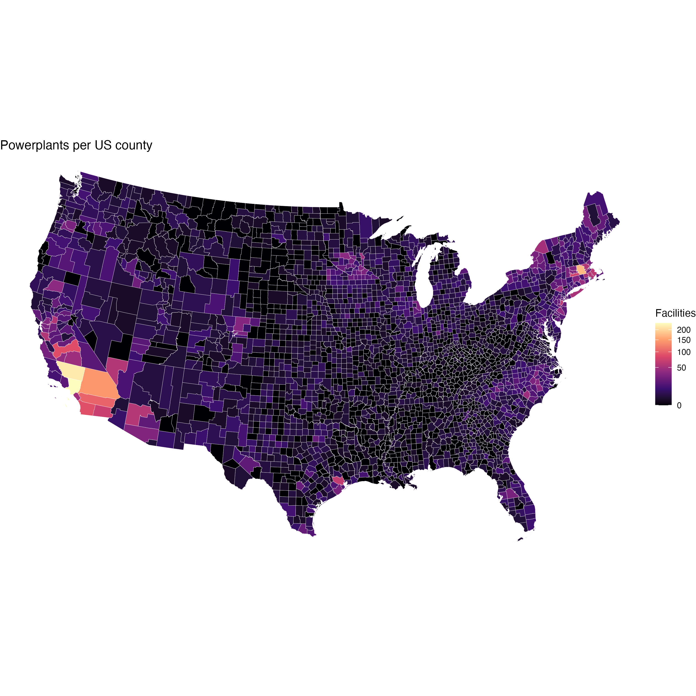
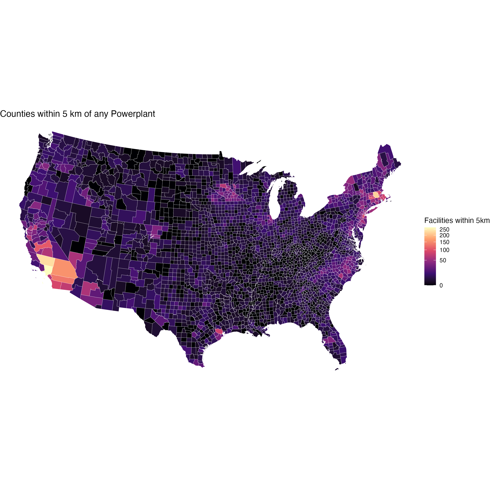
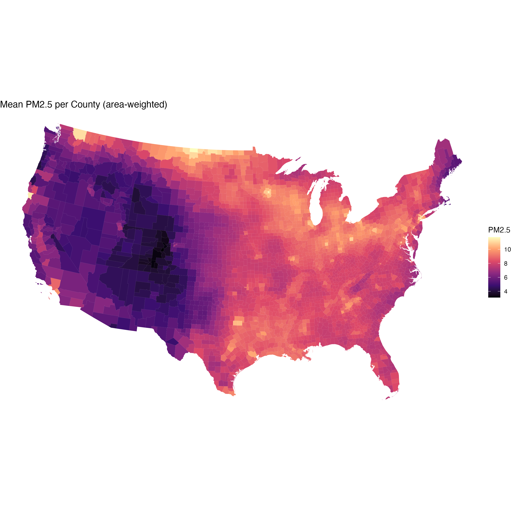
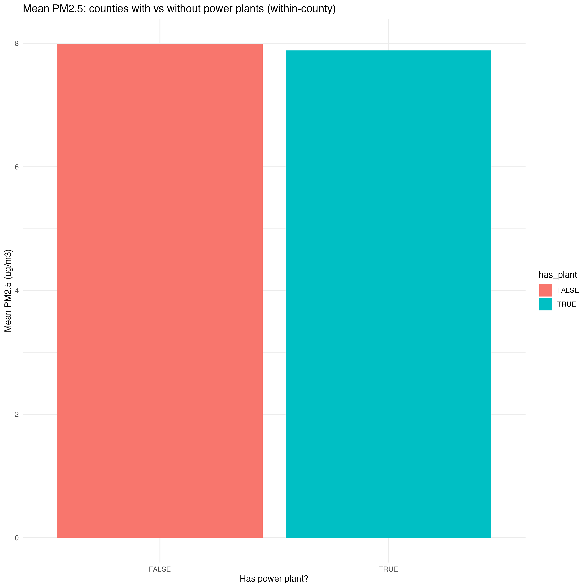
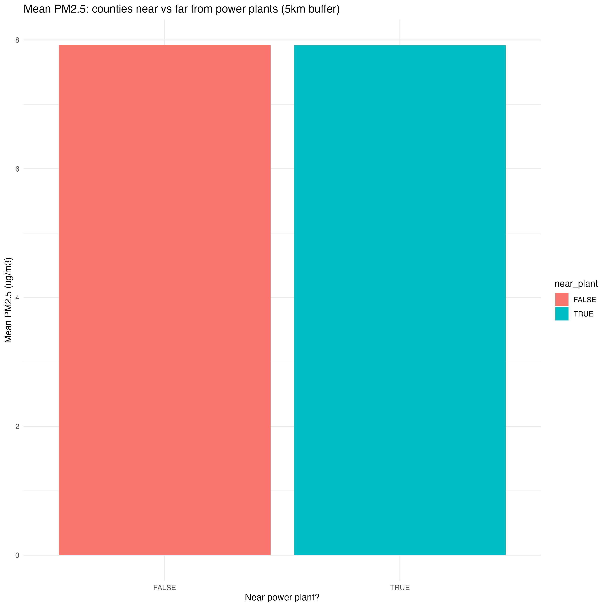

# Overview
This application assignment studies the relationship between PM 2.5 and powerplant location at the county-level in the United States. 

--- 

## Questions
1. How many power plants are in each county? 
2. How many plants are within a given distance of each county? 
3. What is each county's mean PM 2.5? Compare mean PM 2.5 for counties with vs without powerplants, and for counties with vs without powerplants within a given distance. 

--- 

# Question One
{width=30%}
[View CSV](https://github.com/lvt14/Day-6-Application-Assignment/blob/main/outputs/tables/powerplant_distribution_rawcount.csv)

The above map shows the distribution of power plants across the United States, with each county colored according to the number of power plants it contains. The accompanying table provides the exact count of power plants for each county. The fewest seem to lie down the center of the country, while there are more power plants in the Northeast and Southwest (specifically, southern California). 

--- 

# Question Two
I selected a buffer of 5km. I made that choice because it is the finest resolution PM 2.5 data that is available in the dataset. 

{width=30%}
[View CSV](https://github.com/lvt14/Day-6-Application-Assignment/blob/main/outputs/tables/counties_by_number_of_powerplants_within_5km.csv)

The above map shows the distribution of power plants across the United States, with each county colored according to the number of power plants that are located within a 5km buffer of the county. The accompanying table provides the exact count of power plants within a 5km buffer for each county. The distribution of power plants within a 5km buffer is similar to the distribution of power plants within counties, but the Northeast becomes more emphasized, while the Southwest (specifically, southern California) is less prominent. 

--- 

# Question Three 

## What is each county's mean PM 2.5?
{width=30%}
[View CSV](https://github.com/lvt14/Day-6-Application-Assignment/blob/main/outputs/tables/mean_pm25_per_county.csv)

The above map shows the mean PM 2.5 for each county in the United States, with each county colored according to its mean PM 2.5 value. The accompanying table provides the exact mean PM 2.5 value for each county.

Looking at this map compared to the previous two maps, it's clear that the distribution of PM 2.5 is not totally explained by the distribution of powerplants. 

## Compare mean PM 2.5 for counties with vs without powerplants 
{width=30%}
[View CSV](https://github.com/lvt14/Day-6-Application-Assignment/blob/main/outputs/tables/mean_pm25_by_powerplant_presence.csv)

On average there is a slightly higher level of PM 2.5 in counties without powerplants, but the different is so small as to be negligible. 

## Compare mean PM 2.25 for counties with vs without powerplants within a given distance 
Once again, I selected a buffer of 5km, because it is the finest resolution PM 2.5 data that is available in the dataset. 

{width=30%}
[View CSV](https://github.com/lvt14/Day-6-Application-Assignment/blob/main/outputs/tables/mean_pm25_by_nearby_powerplant_5km.csv)

On average there is a slightly higher level of PM 2.5 in counties that do not have a powerplant within 5km of them, but the difference is even smaller than that between counties with vs without powerplants, and is negligible. 